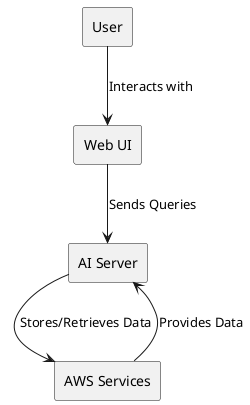
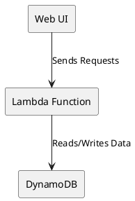
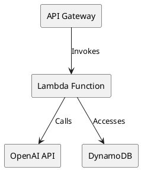
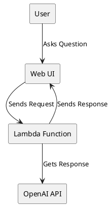
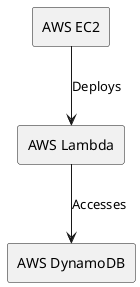
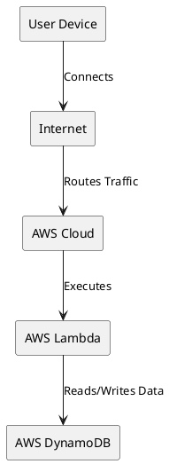
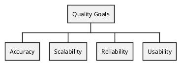

# Study Buddy Architecture

[toc]

## 1. Introduction and Goals

Study Buddy is a personalized tutor developed by LabSoft to enhance the learning experience using AI technologies. The main goal is to provide customized learning plans and resources tailored to individual needs.

## 1.1. Requirements Overview

- **Personalized Learning Plans:** Use AI to create and adapt learning plans based on user data.
- **Progress Tracking:** Monitor and evaluate learning progress with detailed analytics.
- **Interactive Tutorials:** Provide real-time assistance and answers to user queries.
- **User-Friendly Interface:** Ensure an intuitive and engaging user experience.

More detailed requirements can be found in [User Stories](user_stories.md).

## 1.2. Quality Goals

- **Accuracy:** Ensure the AI provides correct and useful information.
- **Scalability:** Support a growing number of users without performance degradation.
- **Reliability:** Maintain high availability and handle failures gracefully.
- **Usability:** Deliver a seamless and intuitive user interface.

## 1.3. Stakeholders

- **End Users:** Students and learners using Study Buddy for educational purposes.
- **Developers:** [LabSoft](https://labsoft.ai/) team responsible for developing and maintaining the system.
- **Product Owners:** Individuals defining requirements and ensuring project alignment with goals.

---

## 2. Architecture Constraints

- **Technology Stack:** Use Python, OpenAI, Boto3, and AWS services.
- **Deployment Environment:** Host on AWS with components like DynamoDB and Lambda functions.
- **Security:** Ensure data privacy and protection, particularly for user data.

---

## 3. System Scope and Context

### 3.1. Business Context

Study Buddy aims to revolutionize the educational landscape by providing tailored learning experiences, thereby improving educational outcomes and user satisfaction.

### 3.2. Technical Context

- **Frontend:** Web-based user interface for interaction with the system build on [ionic framework](https://ionicframework.com/) for cross-platform deployment (Android, iOS, Mac).
- **Backend:** Python-based application handling AI responses and data management.
- **Data Storage:** AWS DynamoDB for storing questions, responses, and user data.

---

## 4. Solution Strategy

- **AI Integration:** Utilize OpenAI for generating responses to user queries.
- **Cloud Services:** Leverage AWS for scalable and reliable infrastructure.
- **Continuous Improvement:** Regularly update the AI model and software to incorporate feedback and new features.

---

## 5. Building Block View

Using [C4 model](https://c4model.com/) description.

### 5.1. System Context - C4

### 5.2. Containers - C3

### 5.3. Components - C2

---

## 6. Runtime View

---

## 7. Deployment View

### 7.1. Infrastructure Level 1

### 7.2. Infrastructure Level 2

---

## 8. Cross-cutting Concepts

- **Security:** Implement robust authentication and authorization mechanisms.
- **Logging:** Maintain comprehensive logs for monitoring and debugging.
- **Error Handling:** Ensure graceful handling and reporting of errors.

---

## 9. Architecture Decisions

- **Tech Stack:** Use Python and AWS for their reliability and scalability.
- **AI Model:** Leverage OpenAI for its advanced natural language processing capabilities.

---

## 10. Quality Requirements

### 10.1. Quality Tree

### 10.2. Quality Scenarios

- **Scenario 1:** The system must handle 100,000 simultaneous users without performance degradation.
- **Scenario 2:** The AI must provide responses with 95% accuracy based on test datasets.

---

## 11. Risks and Technical Debts

- **Risk 1:** Dependency on third-party APIs like OpenAI.

## 12. Glossary

- **AI:** Artificial Intelligence.
- **API:** Application Programming Interface.
- **DynamoDB:** A NoSQL database service provided by AWS.
- **Lambda:** A serverless compute service provided by AWS.
